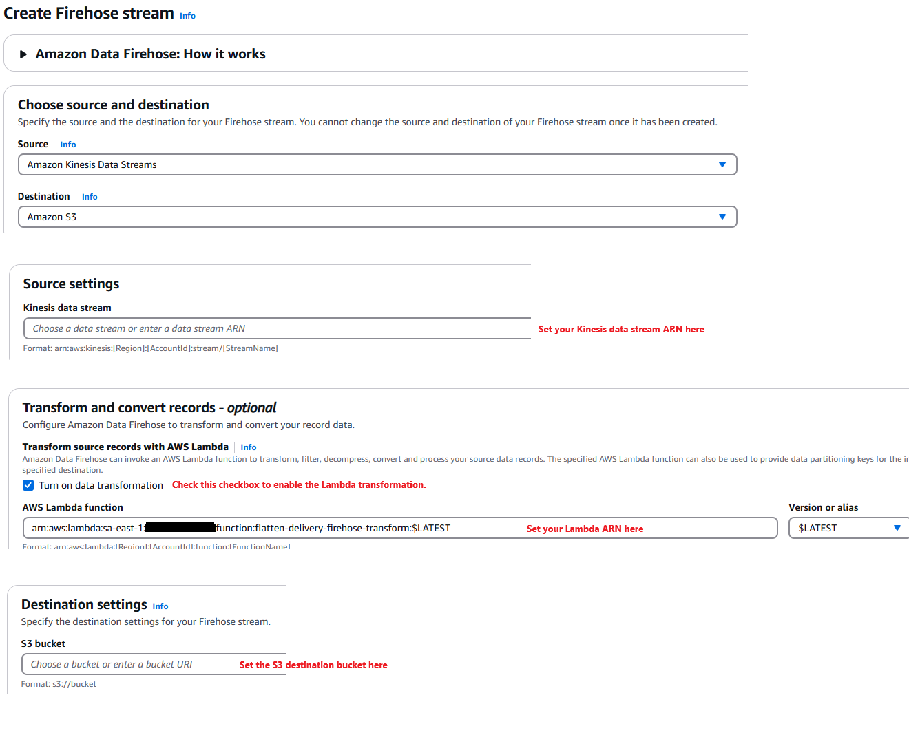

# **Postgres > CDC > DMS > Kinesis > Firehose > Lambda > S3**

This project demonstrates a data pipeline that captures **Change Data Capture (CDC)** events from a **PostgreSQL** database running locally in Docker and transfers them to **AWS S3**. The following AWS services are used to build this end-to-end solution:

---

## **Architecture Overview**

The architecture captures changes from a **PostgreSQL** database running locally and pushes them to AWS **S3**. 

**Data Flow:**
| **Tool**         | **Purpose**                                |
|------------------|--------------------------------------------|
| **PostgreSQL**    | Source database with CDC enabled           |
| **DMS**           | Captures changes from PostgreSQL and streams them to Kinesis |
| **Kinesis**       | Streams real-time data from DMS to Firehose|
| **Firehose**      | Buffers and writes raw data to S3 and calls Lambda for transformation |
| **Lambda**        | Transforms the CDC records and saves them as .json files in S3 |
| **S3**            | Final storage for raw and transformed CDC files|

---

## **Tools Used**

### **1. PostgreSQL (Docker)**
**Description:** Local PostgreSQL database used as the source for Change Data Capture (CDC).

**Tools/Tech:**
- Docker container with PostgreSQL.
- **Ngrok** to expose the local PostgreSQL database to AWS DMS via a public URL.

**Commands Used:**
```bash
# Set WAL level to 'logical' to enable CDC
ALTER SYSTEM SET wal_level = 'logical';

# Expose PostgreSQL via ngrok
 ngrok tcp 5432
```

### **2. AWS DMS (Database Migration Service)**
**Description:** AWS DMS is used to capture changes from the PostgreSQL database using CDC and stream them to Kinesis.

**Tools/Tech:**
- **AWS DMS Task**: Uses the **CDC** option to capture ongoing changes from PostgreSQL.
- **DMS Replication Instance**: Handles the migration and CDC.
- **DMS Endpoints**: Source (PostgreSQL) and Target (Kinesis).


**Key Configurations:**
- **Source Endpoint**: Uses **Ngrok** public URL to connect to PostgreSQL.
- **Target Endpoint**: Points to the **Kinesis** stream.


### **3. AWS Kinesis**
**Description:** AWS Kinesis processes real-time streams from DMS and passes them to Firehose.

**Tools/Tech:**
- **Kinesis Data Stream**: Receives and holds the data stream from DMS.

**Key Configurations:**
- **Shard Count**: 1 (Can be scaled as needed).
- **Data Retention**: Default is 24 hours, but can be customized.


### **4. AWS Firehose**
**Description:** Firehose receives the Kinesis stream, writes the raw data to an S3 **raw/** folder, and then calls a **Lambda function** to transform and save the data as **.json** files.

**Tools/Tech:**
- **Firehose Delivery Stream**: Pulls data from Kinesis, saves raw data to **S3/raw/**, and triggers **AWS Lambda** for transformation.

**Key Configurations:**
- **Source**: Kinesis Stream.
- **Destination**: S3 bucket (with prefix **raw/** for unprocessed data).
- **Transformation**: Calls **AWS Lambda** to process and clean the raw data.
- **Final Destination**: Saves transformed data as **.json** files back to S3.
- **Data Format**: transformed data is stored as **.json**.
- **Buffer Size/Interval**: Data is flushed to S3 when either **1MB** of data is accumulated or **60 seconds** have passed, whichever comes first. **Note:** These values should be adjusted based on the stream's volume and frequency to optimize cost and performance.



### **5. AWS Lambda (Transformation)**
**Description:** AWS Lambda applies transformations to the incoming stream received from **Firehose** before it is saved to S3 as **.json** files.

**Tools/Tech:**
- **Lambda Function**: Receives, decodes, and transforms the CDC records.
- **Trigger**: **AWS Firehose** triggers the Lambda function to process raw CDC data.
- **Final Destination**: Transformed data is saved as **.json** files back to S3.

**Transformation Details:**
- **Input Data**: Base64-encoded raw data from Firehose.
- **Data Processing**: Decodes base64, parses the data, applies transformations, and adds metadata.
- **Output Format**: Transformed data is encoded back to base64 and sent to Firehose for storage as **.json**.

**Lambda Function Code:**
AWS Lambda code may be find here:  [`Transformation Code`](https://github.com/rodrigo85/cdc_kinesis_ingestion/blob/ee5935517288f80f2b6ee5526453fb0fb4a00f2d/lambda-flatten-delivery-firehose-transform.zip).

### **6. AWS S3 (Final Destination)**
**Description:** AWS S3 serves as the final storage location for the transformed CDC files. The raw data from Firehose is stored in the **raw/** folder, while the **Lambda-transformed data** is stored as **.json** files.


## 🧪 **Testing the CDC Pipeline**

This section demonstrates how to test the end-to-end CDC pipeline, from inserting new data in PostgreSQL to viewing the final transformed results in S3.

---

### 🐘 **1. Insert Data into PostgreSQL**
To trigger the CDC pipeline, you need to insert new records into the **PostgreSQL** database. The SQL commands to insert data are located in the file:  
📄 [**scripts/insert.sql**](https://github.com/rodrigo85/cdc_kinesis_ingestion/blob/a8fb170794f637816e9bb8b88bda9454643c71ff/scripts/insert.sql)


### 🔄 **2. AWS DMS Migration Task**
Once the new data is inserted into the PostgreSQL database, the AWS DMS Migration Task will capture the changes (CDC) and stream them to Kinesis.  


### 🛠️ **3. AWS Lambda Transformation Log**
After the CDC data is streamed from Firehose to Lambda, the transformation logic is applied to the records. You can check the logs of the Lambda function to verify if the transformation was successful.


### ☁️ **4. View Transformed Data in S3**
Finally, the transformed .json files are stored in S3 under the following structure:


You may find the formatted output example here:
📄 [**Result Json**](https://github.com/rodrigo85/cdc_kinesis_ingestion/blob/a8fb170794f637816e9bb8b88bda9454643c71ff/s3_result/KDS-S3-4ezyO-1-2024-12-16-13-24-38-46a04abb-a06b-44b3-ad3e-4cfe28869a19.json)
